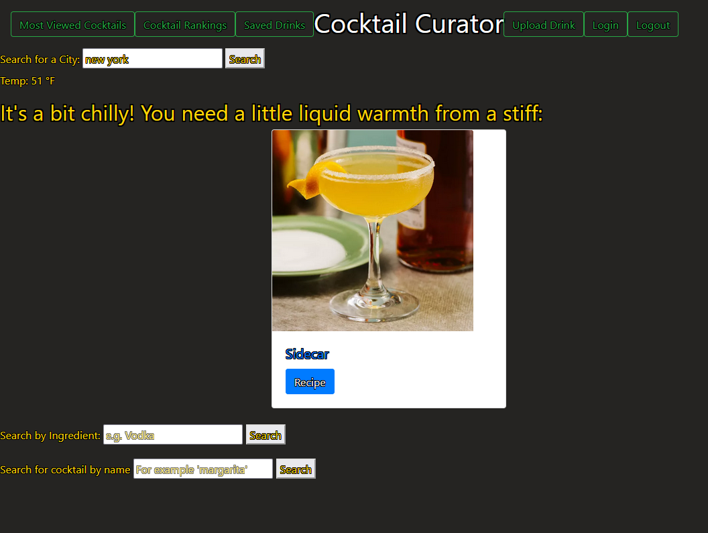
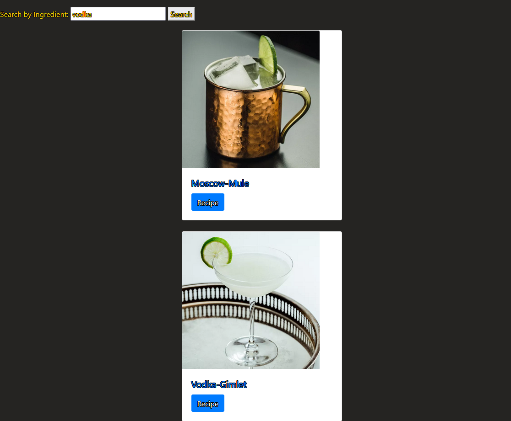
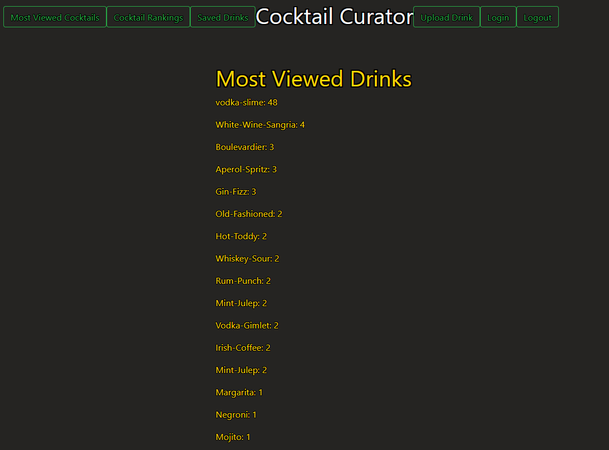
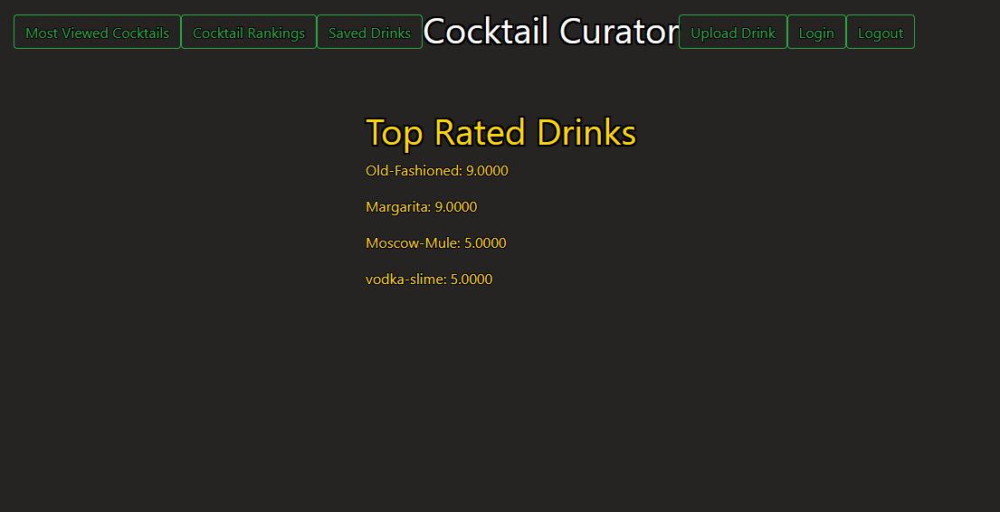
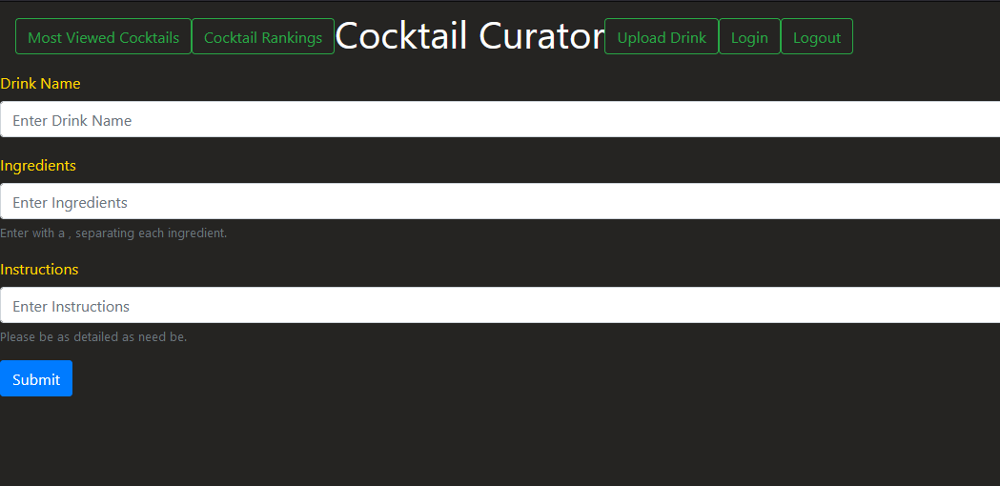

# Cocktail-Curator-3.0

Welcome to the Cocktail Curator! We've created a page to offer recommendations based on the temperature of the city you're searching, as well as the option to search by ingredient and name to see all the possible choices out there! There is also an option to save those drinks to a list associated to your account for you to refer to later for when the opportunity arises. We've also got new functionality added since the last iteration as well! The ability to see the most viewed drinks, ranking and the ability to upload your own drinks.

Here is our deployed site on heroku! https://cocktail-curator-3.herokuapp.com/

Here is an example of the weather option in action. It takes the temperature in the given city and offers you a recommendation too match.

After an ingredient search this is what it will be like once returned. A list of all drinks using that ingredient will be displayed.

You can go and search by name as well if you wanted to look up a specific one as well.

Heres an example of the most viewed drinks.

The rankings of drinks shown in order of the best.

The upload drink page offers the option to add a name, its ingredients and the instructions on how to make said cocktail.

